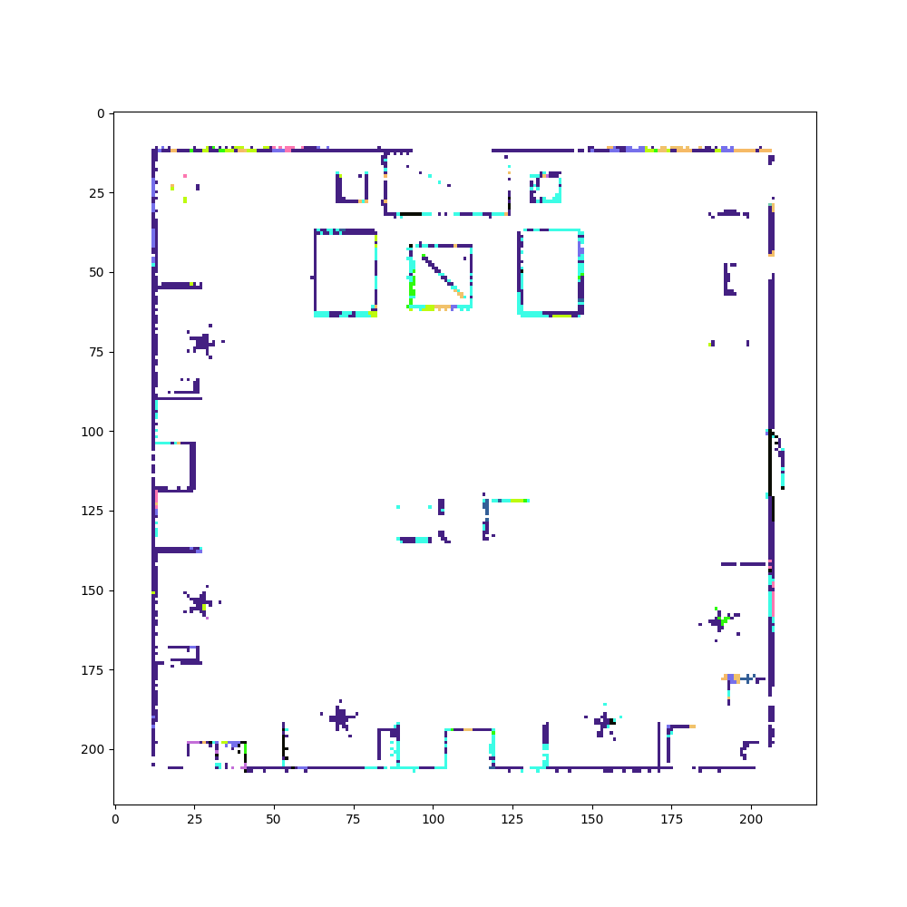
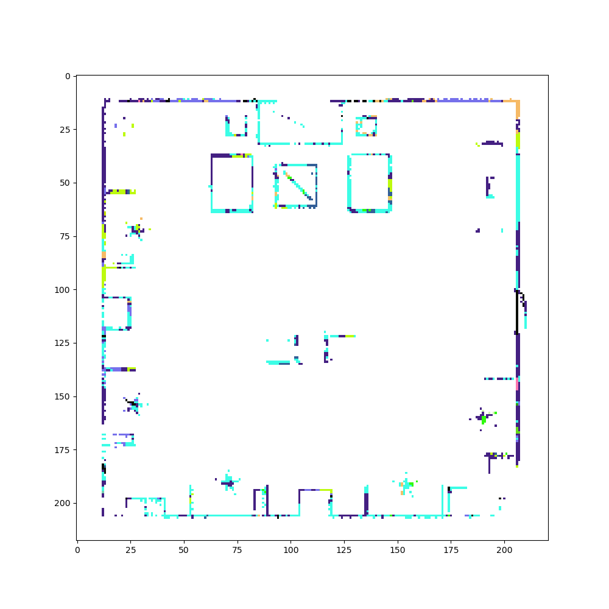

# Object-based Mapping for Mobile Robots in Indoor Environments

## Members: Ajay Ragh, Faris Hajdarpasic, Prasanna Bijja

## Supervisor: Dr. Tiziano Guadagnino

### Relevance:

Robots that are expected to navigate efficiently through real-world environments need maps to localize themself and plan actions. These maps just contain purely geometric information as the robot needs a semantic understanding of its surroundings to fulfill their tasks. In this project, we address the problem of
object-based mapping for mobile robots in indoor environments. The goal of the project is to realize a mapping system where an occupancy representation of the scene is enhanced with object level semantics. This high-level understanding of the scene should be suitable for other robots to localize and plan actions.

### Data Acquisition
A gazebo simulation of an indoor environment is used. Through this environment we move a robot which collects RGBD and Lidar data.

#### gazebo indoor environment

### Camera motion visualisation

### Experimental map segmentation visualised
#### Label colors for reference

#### segmentation by choosing the most repeated label for a cell in occupancy grid

#### segmentation by multiplying the past probabilities for each label with new probabilities for the label in the same cell

#### segmentation by adding the label probabilities for the same cell and finding maximum probability after softmax in each cell of occupancy grid

